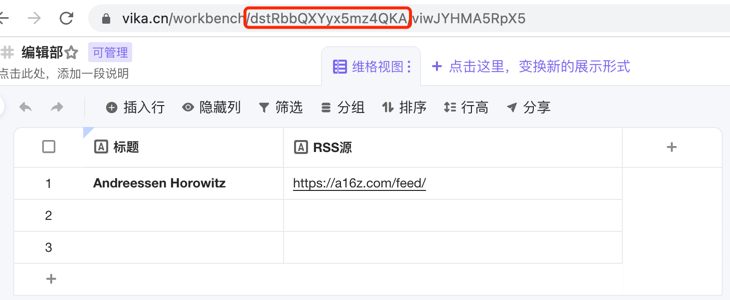

# feedflare

feedflare - distribute feeds to IM

default sync articles within `yesterday` !


### Setup

```shell script
python3 -m virtualenv venv  # or virtualenv -p python3 venv
source venv/bin/activate
pip install -r requirements.txt
```

### Usage

copy config.py.tpl to config.py

1. For individual use:



create your own table with copying the [RSS template](https://vika.cn/share/shrRC6kNJicmrBXPsLu5q), and copy the vika API token and table id to config.py

create your own feishu bot, and copy the [bot webhook](https://open.feishu.cn/open-apis/bot/v2/hook/xxx) to config.py

```shell
python main.py -t individual
```

2. For team use:

Please read the code for more details.

```shell
python main.py -t team
```
